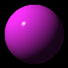

# pytrace

toy ray tracer implemented in python.
based off of ["The Ray Tracer Challenge" by Jamis Buck](http://raytracerchallenge.com/)



## Development Setup

1. Create new virtual environment `python -m venv <env-name>`
2. Activate environment `./<env-name>/Scripts/activate`
3. Install requirements `pip install -r requirements.dev.txt`

## Running Examples

1. activate environment
2. `python examples/raysphere3d_demo.py`

## Running Tests

```sh
$ python -m unittest tests
```

To also get code coverage report, use:

```sh
$ coverage run --source=. -m unittest discover
$ coverage report
```

## Linting

```sh
$ pylint src
```
